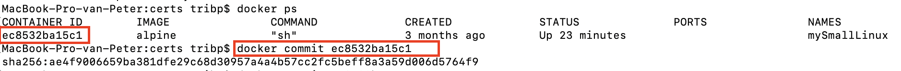
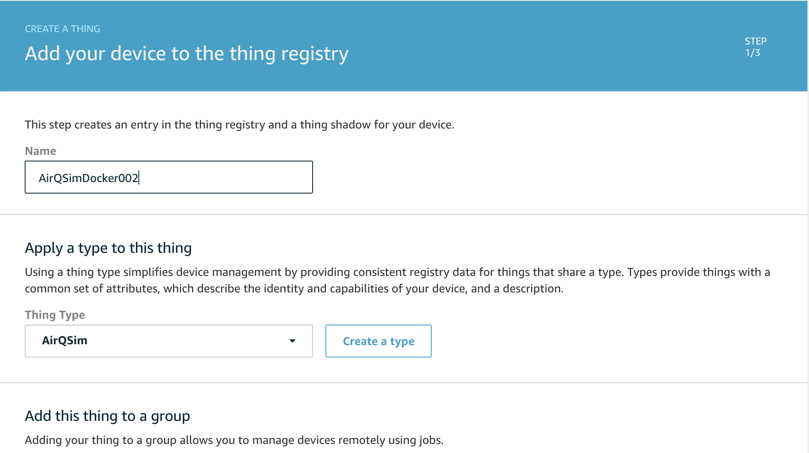
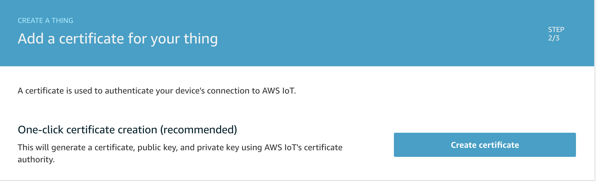
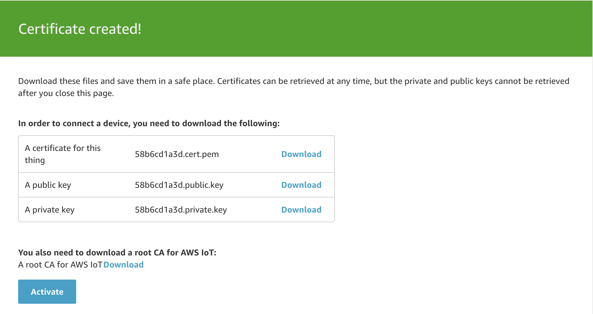
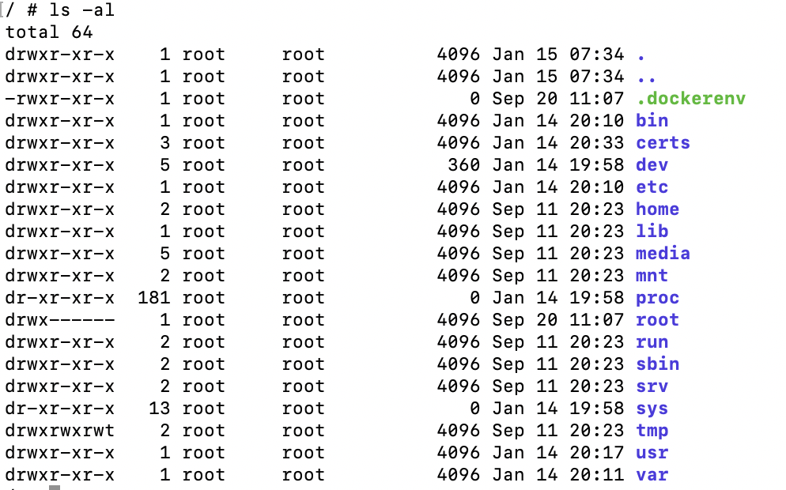
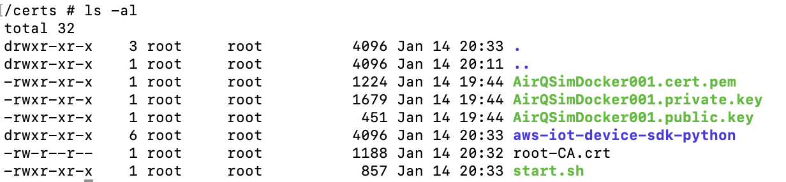
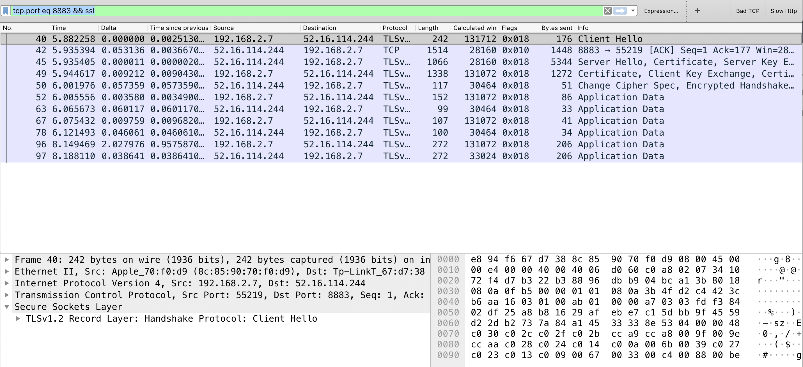
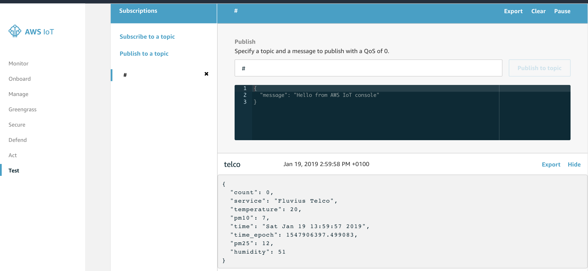

# Iot-Sim-in-Docker4AWS

## Goal
The goal is to make a software Iot simulation device in Docker for AWS.
The device will send Iot messages to AWS-Iot hub for test purposes.

## Steps we will take:

1. Install Docker
2. Run Alpine container
3. Pimp this container
4. Create 'thing' in AWS
5. Prepare container with AWS-SDK + AWS certificates
6. Run (software) Iot device
7. Verify messages in AWS
8. Optional: prepare Pipeline + database
9. Visualize

## 1 Install Docker
### 1.1 Install Docker CE (Community Edition) on MAC / PC

https://docs.docker.com/install/overview/

### 1.2 Verify Docker
```
docker --version
Docker version 18.03.0-ce, build 0520e24
```
PS: see other Repo for additional Docker commands or info
https://github.com/tribp/Docker-Getting-Started

## 2 Run Alpine container
Why 'Alpine' ?
Lets give it a try :-)

Alpine is the 'leanest' linux distribution, stripped from EVERYTHING, but the essential.
Pro -> this will give us a very small distribution (5MB) for the local PC, with an extra bonus of a minimal security attack surface and finally a better understanding of what components we need.

```
docker pull alpine                                          -> pulls latest image of alpine
docker container run -it --name mySmallLinux alpine sh      -> start container + shell
```
## 3 Pimp this container
We even need some basic stuff, remember the 5MB footprint, + ...

Essential things we need:
- nano as text editor
- bash to execute our script
- git to get the repositories
- python

For this we will use 'apk' the Alpine package manager
see: https://wiki.alpinelinux.org/wiki/Alpine_Linux_package_management

### 3.1 Commands  

```
apk add nano
apk add bash
apk add git
apk add python

```
### 3.2 Saving your homework

In order not to lose our homework an to keep all the changes to this container we need to tell docker to do so.  
First we need to get the ID of the container and then execute a commit on this container.

Get the id of the container:
```
docker ps
```

Commit (save) the container
PS: additional info about version info etc :
https://docs.docker.com/engine/reference/commandline/commit/

```
docker ec8532ba15c1 commit
```



### 3.3 Testing if everything is saved

```
docker stop mySmallLinux
docker start mySmallLinux
```

## 4 Create 'thing' in AWS
  - goto 'AWS-Iot':
    - 'manage' -> 'Things'
      - create your thing
      - create your certificates
      - download your certificates
      - create a policy for your thing ( or thing family)
In AWS:      

## Create your thing



## Create your certificates



## Download your certificates



## Create a policy for your thing ( or thing family)

    

## 5 Prepare for MQTT AWS certificates

First we will have to copy the certifications and for mqtt we have to options:

  - the well known Paho library
  or
  -  the AWS-Iot-SDK library (based on Paho)

### 5.1 Copy files

First, we have to copy the files from our local Mac/PC to our Docker instance.
Luckily, this is pretty straightforeward in docker. Just prepend 'docker' before your common linux commands :-)

To do:
- create 'certs' directory in your docker instance
- Copy the 3 'Thing certificates' , the root CA certificate and the start script ('start.sh') to the cert dir.

##5.1 commands

On the docker container:
```
mkdir certs

```

On your Mac/PC: -> ' docker cp YOUR_LOCAL_PATH  CONTAINERNAME:/PATH'
```
docker cp /Users/tribp/Data/brol/certs mySmallLinux:/certs

```

### 5.2 Option 1: Using the 'Paho' mqtt library

'pahoo.mqtt.client' -> In order to install this python library we first need 'pip', the python package manager

```
apk add py-pip
pip install paho-mqtt
```


### 5.3 Option 2: Using the AWS-Iot-SDK (AWSIoTPythonSDK.MQTTLib)

https://github.com/aws/aws-iot-device-sdk-python


On the docker container:
```
cd certs
bash start.sh

```

#### 5.3.1 Remark: what is going on behind the scenes:
If you look into the start.sh script, you will notice that the last line is the launch of the actual python program:

'python -e AWS_IOT_ENDPOINT -r rootCA THING_CERT THING_KEY'

```
python aws-iot-device-sdk-python/samples/basicPubSub/basicPubSub.py -e xxxxxxxxxxx-yyy.iot.eu-west-1.amazonaws.com -r root-CA.crt -c AirQSimDocker001.cert.pem -k AirQSimDocker001.private.key
```

### 5.4 Saving your homework

Dont't forget to run 'docker ec8532ba15c1 commit' to save your changes to the container.

Everything should be ready now on your container:

Container ROOT directory:



Container certs directory:




## 5.5 Start your (software) Thing !!!

- using paho
```
python devSim2AWS_Pahoo.py

```

- using AWS-Iot-sdk
```
python devSim2AWS_awsSDK.py

```

Your device is RUNNING and sending messages to AWS_IOT_ENDPOINT



## 7 Verify messages in AWS




PS: if your device is running correctly but you don't see messages in AWS

check:
  - 'ENDPOINT', port nr, certificates
  - 'Policy' -> in AWS console , and Policy is attached to certificate.

    Policy has:
        - Resource = 'endpoint' + ClientId  ( or simply ' * ' = not best practice )
        - Action = allow / deny
        - topic ( ' * ' = not best practice)

[see policy example](./examples/aws_policy_4_thing.txt)

## 8 Optional: prepare Pipeline + database
to do
## 9 Optional: Visualize
to do
```


```
